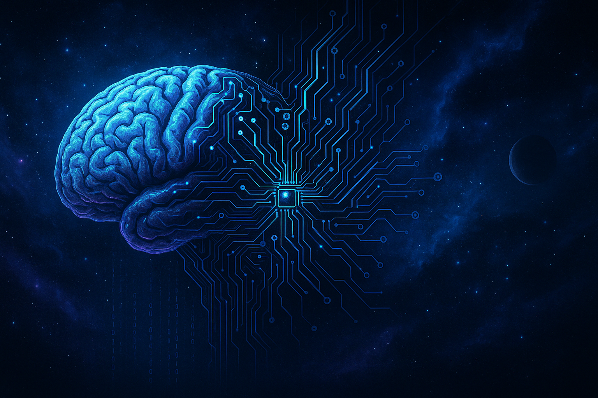

  

# 👋 Welcome, fellow explorer

I'm engineer with a deep interest in the future of humanity.
I'm passionate about **AI, biotechnology, neuroscience, and space technologies**, and I'm exploring how human cognition might one day connect with machine intelligence.
---

## 🧠 Who I Am

- 🦀 Developer working with **Rust**, **Go**, and systems close to the hardware.
- 🔧 I enjoy building clean backend architectures, APIs, and experimenting with embedded and performance-critical code.
- 🧬 I explore topics like **neurointerfaces**, **biomaterials**, and **cognitive augmentation** in my free time.
- 🌌 I'm deeply curious about the future — from **space exploration** to **digital consciousness**.
- 🤝 Open to collaborations on ideas that push technological and human boundaries.

---

## 🚀 Vision & Purpose

> “We are not meant to adapt to the world — we are meant to *redefine* it.”

I believe that the next step in human evolution is not natural selection — it's conscious engineering.
Through **neural polymers**, **biointerfaces**, and **artificial cognition**, we can create beings capable of thriving in space, mastering logic, and rewriting what it means to be alive.

> <!-- START:QUOTE -->
> “We are not meant to adapt to the world — we are meant to *redefine* it.”
> <!-- END:QUOTE -->

---

## 🛠️ Tech Stack

## 📫 Connect with Me

- Telegram: [@GilfoyleCore](https://t.me/GilfoyleCore)

---

> 🧭 *Code is the language of gods. My mission is to evolve with it.*
